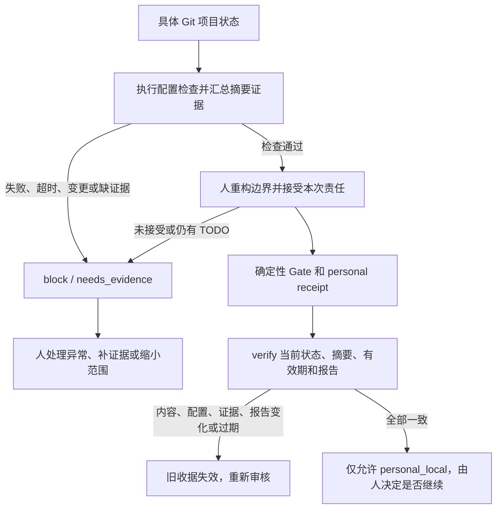

# Delivery Clearance Validation

Validation date: 2026-07-13

Current validated scope: `personal_local`

## 1. Executive Summary

本章验证的是 Delivery Clearance 的本地个人项目审核原型，而不是 AI 正确性、
生产安全或真实用户价值。当前仓库已实现一条可重复的 `init -> audit -> verify`
链路：对一个具体 Git 项目状态执行显式配置的检查，汇总摘要化证据、异常、人类边界
重构和责任接受，并生成受状态、配置、证据摘要和有效期共同约束的收据。2026-07-13
本地复现结果为：Personal Clearance MVP 验证器的 14 个命名场景全部通过，聚焦单元测试
的 12 个场景全部通过。该结果只能证明原型的确定性机制按当前测试工作；仓库暂无真实
用户审核时间、误放行率、误阻断率、生产事故率或企业采用证据。

证据成熟度在本文中严格分为三层：

- **已实现**：代码、契约或命令存在；
- **已场景验证**：可重复测试已运行并得到预期状态；
- **尚未用户验证**：没有真实用户或现实交付结果支持价值结论。

## 2. Problem and Target Scenario

### 目标使用者

当前可用目标用户是一名使用生成式 AI 辅助开发、并对自己本地项目负责的操作者。
外部客户、生产运维者、受监管专业人员和独立审核方不在 Personal Clearance MVP 的
授权范围内。代码中的 `PersonalClearanceConfigV1.maximum_scope` 和
`PersonalClearanceReceiptV1.approved_scope` 将允许范围固定为 `personal_local`。

### 典型交付物

- AI 生成或修改的代码、测试、配置和文档；
- 准备继续开发、提交、合并或转入下一本地步骤的 Git 项目状态；
- 可由确定性命令检查、但仍需要人确认目的、非目标、关键失败路径、回滚和证据限制的
  本地候选物。

### 需要解决的问题

项目假设是：AI 交付量增长后，让人逐项通篇复核会形成不可扩展的时间和认知负担。
当前原型不声称已经量化该负担，而是先验证一种审核拆分是否可执行：

1. 工具重复执行确定性检查并保存摘要化证据；
2. 人只重构目的、边界、异常、剩余风险和责任；
3. 确定性 Gate 决定当前状态是否满足已声明的 `personal_local` 条件；
4. 人保留继续使用、缩小范围、补证据或停止的最终责任。

## 3. Core Hypotheses

| Hypothesis | 可证伪描述 | 对应测试或验证器 |
| --- | --- | --- |
| H1 | 给定一个具体 Git 项目和检查配置，系统能够生成项目快照、检查结果、边界重构、证据包、Gate 决定和最终收据；任一核心产物无法生成即否定 H1。 | `test_explicit_checks_and_responsibility_allow_only_personal_local`；`complete_self_audit_allows_personal_local` |
| H2 | 收据绑定当前项目状态和审核配置；修改内容或配置后旧收据仍通过即否定 H2。 | `test_state_change_and_expiry_invalidate_receipt`；`test_config_change_invalidates_receipt` |
| H3 | 收据具有有效期，且旧记录不能覆盖到新状态继续使用；过期或重放仍通过即否定 H3。 | `test_state_change_and_expiry_invalidate_receipt`；`test_old_receipt_replay_after_new_audit_is_rejected` |
| H4 | 篡改、证据缺失、未执行检查或检查失败不会静默放行；任一异常返回 `allow` 即否定 H4。 | `test_tamper_and_scope_expansion_are_rejected`；`test_missing_critical_artifact_blocks_verification`；`test_failed_check_blocks`；`unexecuted_checks_block` |
| H5 | 人类责任接受是每次运行的显式条件，不能由 AI 自审或静态配置替代；未接受责任仍放行即否定 H5。 | `test_missing_responsibility_never_allows`；`missing_run_specific_responsibility_blocks` |
| H6 | 审核检查本身改变 Git 可见状态时必须硬阻断；发生变更后仍放行即否定 H6。 | `test_check_that_mutates_project_is_a_hard_deny`；`check_mutation_is_hard_deny` |

## 4. Validation Scope and Non-goals

### 本轮范围

- 本地 Git 仓库；
- 当前 `HEAD`、分支摘要、暂存和未暂存 diff 摘要、非忽略未跟踪内容摘要、子模块摘要；
- `.delivery-clearance/personal-clearance.json` 的配置摘要；
- 操作者明确授权的 argv 数组检查；
- 目的、非目标、关键失败路径、回滚条件、回滚方案和证据限制；
- 确定性 Trust Kernel 重放；
- `personal_local` 范围的机器可读收据和静态 HTML 报告。

### 非目标

- 不证明 AI 生成内容正确；
- 不证明节省时间、降低成本或显著改善质量；
- 不替代独立人工审核、专业资格判断或受影响者同意；
- 不构成客户交付、生产部署、法律、合规或安全认证；
- 不提供配置检查的 OS 级沙箱、网络隔离或外部副作用观测；
- 不把另一个模型的自审当作最终信任来源；
- 不验证非 Git 文件夹、SaaS 状态、数据库、浏览器或桌面应用的完整状态。

## 5. Test Matrix

以下“实际状态”来自 2026-07-13 在当前分支执行的仓库命令。`PASS` 表示测试观察到
预期的放行、阻断或失效行为，不表示交付物本身正确。

| Case ID | 场景 | 输入 / 前置条件 | 执行步骤 | 预期状态 | 实际状态 | 证据路径 | 结论 |
| --- | --- | --- | --- | --- | --- | --- | --- |
| VAL-01 | 正常检查通过 | 完整配置；执行检查；操作者接受责任 | `audit` 后 `verify` | `allow`，仅 `personal_local` | PASS | `apps/api/tests/test_personal_clearance.py::test_explicit_checks_and_responsibility_allow_only_personal_local` | 正常链路已场景验证 |
| VAL-02 | 项目内容变化 | 已生成允许收据，随后增加非忽略文件 | 再次执行 `verify` | 失败，包含 `project_state_current` | PASS | `test_state_change_and_expiry_invalidate_receipt` | 旧结论不随内容变化继承 |
| VAL-03 | 配置或规则变化 | 已生成允许收据，随后修改 `purpose` | 再次执行 `verify` | 失败，包含 `config_current` | PASS | `test_config_change_invalidates_receipt` | 审核边界改变后必须重审 |
| VAL-04 | 检查结果过期 | 使用超过 `expires_at` 的验证时间 | 调用验证函数 | 失败，包含 `receipt_not_expired` | PASS | `test_state_change_and_expiry_invalidate_receipt` | 收据不能长期静态复用 |
| VAL-05 | 审核记录被篡改 | 修改收据中的 policy digest | 执行 `verify` | 失败，包含 `policy_digest_matches` | PASS | `test_tamper_and_scope_expansion_are_rejected`；`receipt_tamper_is_rejected` | 摘要不一致时拒绝放行 |
| VAL-06 | 关键证据缺失 | 删除 `evidence-bundle.json` | 执行 `verify` | 错误并指出缺失 artifact | PASS | `test_missing_critical_artifact_blocks_verification` | 缺证据不会降级为通过 |
| VAL-07 | 旧记录重放 | 新状态完成再次审核后，用旧 receipt 覆盖新 receipt | 执行 `verify` | 失败，包含 `receipt_bound_to_subject` | PASS | `test_old_receipt_replay_after_new_audit_is_rejected` | 旧收据不能移植到新状态 |
| VAL-08 | 人工拒绝承担责任 | 执行检查但不传 `--accept-responsibility` | 执行 `audit` | `needs_evidence`，范围 `blocked` | PASS | `test_missing_responsibility_never_allows`；`missing_run_specific_responsibility_blocks` | 人工确认是运行级必要条件 |
| VAL-09 | 要求重新复核检查 | 不传 `--execute-checks` | 执行 `audit` | `needs_evidence`，缺 `configured_checks` | PASS | `unexecuted_checks_block` | 未运行的检查不能被视为通过 |
| VAL-10 | 确定性检查失败 | 必需命令返回非零 | 执行 `audit` | `block`，包含 `evidence_failed:configured_checks` | PASS | `test_failed_check_blocks` | 已知检查异常直接进入人工处理 |
| VAL-11 | 审核检查改变项目 | 检查写入 Git 可见文件 | 执行 `audit` | `block`，触发 `hard_deny:audit_check_mutated_project` | PASS | `test_check_that_mutates_project_is_a_hard_deny`；`check_mutation_is_hard_deny` | 检查过程污染被硬阻断 |
| VAL-12 | 试图扩大交付范围 | 将 config 的 `maximum_scope` 改成 customer handoff | 加载 Pydantic 契约 | schema 拒绝 | PASS | `test_tamper_and_scope_expansion_are_rejected`；`scope_expansion_is_schema_rejected` | Personal MVP 不能自我升级权限 |

状态流转如下：



## 6. Reproducible Procedure

### 6.1 从干净 checkout 准备环境

项目要求 Python 3.11 或 3.12，定义见 `pyproject.toml`。

```bash
git clone https://github.com/jzvcpe-goat/study-anything.git
cd study-anything
python3.11 -m venv .venv
.venv/bin/python -m pip install -e .
.venv/bin/delivery-clearance --help
```

### 6.2 运行结构化验证资产

```bash
.venv/bin/python scripts/verify_personal_clearance_mvp.py --check
.venv/bin/python -m unittest discover -s apps/api/tests -p 'test_personal_clearance.py'
```

预期结果：

- 验证器输出 `status: pass`、`case_count: 14`、`maximum_scope: personal_local`；
- 单元测试输出 `Ran 12 tests` 和 `OK`；
- 任一不一致都应产生非零退出码，而不是继续生成允许结论。

### 6.3 在一次性本地 Git 项目复现正常路径

```bash
TARGET="$(mktemp -d)/delivery-clearance-demo"
git init "$TARGET"
mkdir -p "$TARGET/.delivery-clearance"
cp fixtures/personal-clearance/pass-config.json \
  "$TARGET/.delivery-clearance/personal-clearance.json"
printf '/artifacts/\n' > "$TARGET/.delivery-clearance/.gitignore"

.venv/bin/delivery-clearance audit \
  --project "$TARGET" \
  --execute-checks \
  --accept-responsibility
.venv/bin/delivery-clearance verify --project "$TARGET"
```

正常路径只应返回 `approved_scope: personal_local`。生成物位于目标项目的
`.delivery-clearance/artifacts/`，该目录默认由嵌套 `.gitignore` 排除。

### 6.4 复现内容变化失效

```bash
printf 'changed after clearance\n' > "$TARGET/changed-after-clearance.txt"
.venv/bin/delivery-clearance verify --project "$TARGET"
```

预期为非零退出，并包含 `project_state_current`。删除变化不会自动恢复长期授权；操作者
应重新运行 `audit --execute-checks --accept-responsibility`，产生当前状态的新收据。

过期测试通过测试专用 Python 参数使用固定时间复现。公共 CLI 故意不暴露时间覆盖参数，
以避免操作者人为绕过有效期。

## 7. Evidence Inventory

| 证据 | 用途 | 仓库路径 | 当前状态 |
| --- | --- | --- | --- |
| Personal contract models | 配置、快照、检查、重构和收据的严格 schema | `apps/api/study_anything/cbb/personal/models.py` | 已实现 |
| Audit and verification engine | Git 状态采集、检查执行、Gate、摘要绑定、有效期和报告一致性 | `apps/api/study_anything/cbb/personal/audit.py` | 已实现并场景验证 |
| CLI | `init`、`audit`、`verify` 与退出码 | `apps/api/study_anything/cbb/personal/cli.py`；`scripts/personal_clearance.py` | 已实现 |
| Installed entrypoint | wheel 安装后的 `delivery-clearance` 命令 | `pyproject.toml` | 已验证声明存在 |
| Focused tests | 正常、失效、篡改、缺证据、重放、人工责任等 | `apps/api/tests/test_personal_clearance.py` | 12 项通过 |
| Scenario verifier | 14 个命名正反场景及 metadata-only claim boundary | `scripts/verify_personal_clearance_mvp.py` | 14/14 通过 |
| Machine-readable result | verifier 当前预期结果 | `platform/generated/study-anything-personal-clearance-mvp.json` | `status: pass` |
| Example inputs | 完整配置和默认阻断配置 | `fixtures/personal-clearance/pass-config.json`；`placeholder-config.json` | 已提交 |
| JSON schemas | 五个 Personal Clearance 版本化契约 | `platform/schemas/cbb/delivery-clearance.personal-*.schema.json`；`delivery-clearance.project-snapshot.v1.schema.json` | 已提交 |
| Release gate | 在完整和协议局部 release check 中运行 Personal verifier | `scripts/release_check.sh`；`apps/api/tests/test_release_check_script.py` | 已接入 |
| MVP audit record | S0-S15 产品、安全、CLI、移动报告和 release 边界 | `docs/quality-audits/phase-41-personal-clearance-mvp.md` | 历史验证记录 |
| Real plugin boundary study | 外部副作用、可变来源、专业语义和运行时边界 | `docs/quality-audits/phase-42-real-plugin-boundary-study.md` | 已执行的本机样本，不可泛化 |
| Benchmark method | 原生 Agent、强化 Agent、内部 checklist 和独立 Gate 的配对评价方法 | `docs/evaluation/native-agent-vs-delivery-clearance.md` | 机制与流程已实现，真实人类证据未完成 |

仓库没有提交可独立复验的 Personal Clearance 截图文件，因此本文不把截图作为当前证据。
HTML 报告由机器 artifact 确定性重建，`verify` 会检查
`human_report_matches_artifacts`；视觉检查的文字记录位于 Phase 41 audit。

## 8. Findings and Product Decisions

### 8.1 静态通过结论必须改成状态绑定收据

- **原设计问题**：单独保存“检查通过”容易被用于后来已经变化的项目。
- **发现**：内容、配置、证据或有效期都可能使旧结论失真。
- **调整**：收据绑定项目状态、配置、检查、重构、policy、evidence 和 Gate 摘要；
  `verify` 重新采集当前状态并重放确定性 Gate。
- **当前结果**：VAL-02、VAL-03、VAL-04 和 VAL-07 均按预期拒绝旧结论。

### 8.2 安装清单不能代表插件可交付

- **原设计**：Personal Clearance 可以把本地命令结果作为支持证据。
- **发现**：Phase 42 本机测试中，插件 manifest 可解析，但完整回归、依赖加载、浏览器
  附着、外部副作用和专业语义仍可能失败或不可观察。
- **调整**：新增 Plugin Evidence Adapter，将 runtime、输入来源、effect、native verification
  和 domain evidence 分开；外部写入保持硬阻断。
- **当前结果**：提交 `c4f98d71` 将适配器合入，但它仍只能支持 `personal_local`，不能
  证明插件整体可交付。

### 8.3 Git 快照不能冒充外部状态观测

- **原设计风险**：通过本地检查可能让使用者误以为外部系统也受到约束。
- **发现**：Phase 42 的外部 marker 和可变外部来源测试表明，检查可在项目外产生效果，
  或在来源变化后让旧本地收据继续通过。
- **调整**：安全文档和收据明确排除 OS containment、网络、数据库、SaaS 和外部来源
  新鲜度；这些能力需要独立 effect 和 source receipts。
- **当前结果**：声明边界已收紧，但 Personal MVP 对外部状态的技术观测仍未实现。

### 8.4 真人评判必须能够安全暂停

- **原设计**：40 例 benchmark 的盲法真人评判支持断点续跑。
- **发现**：真实终端冒烟测试中，`Ctrl+C` 曾打印 traceback，虽然没有写入不完整证据。
- **调整**：提交 `1524f724` 将中断和输入关闭处理为退出码 `130`，不记录当前 item，
  已完成记录可用 `--resume` 继续。
- **当前结果**：回归测试和真实 PTY 中断测试均通过；正式人类证据仍未填写。

## 9. Current Limitations

- **真实用户价值**：暂无真实用户样本、访谈、再次使用意愿或实际交付结果。
- **审核效率**：暂无可比较的全文复核时间、边界重构时间或认知负担结果。
- **决策质量**：暂无完成的真实人类参考标签，因此不能报告误放行率、误阻断率、严重
  错误逃逸率或人工推翻率。
- **跨项目适配**：Phase 42 只提供本机插件和有限项目形状样本，不能代表大型 monorepo、
  网络文件系统或全部工具链。
- **外部状态**：`verify` 不重新运行检查，也不绑定未快照化的市场数据、网页、SaaS、
  数据库、浏览器或远端仓库状态。
- **执行隔离**：配置检查继承当前用户权限和环境，没有 OS 沙箱或网络 egress 控制。
- **独立性**：Personal Clearance 是操作者自我声明，不是独立安全审计或专业审核。
- **交付范围**：允许结果最多为 `personal_local`；客户、生产、监管和不可逆动作仍阻断。
- **统计效果**：配对 benchmark 已有 40 例机制演练和观察性运行框架，但真实人类重构、
  全文参考复核和盲法裁决尚未完成，因此不能声称 Delivery Clearance 已被证明有效。

## 10. Next-stage User Validation Plan

下一阶段采用增量比较，而不是只测“工具能否运行”。同一个 AI 交付候选应在相同上下文
下分别进入人工全文复核基线和 Delivery Clearance 边界重构流程，再比较增量成本与结果。

### 计划观察指标

- 单次全文复核和边界重构的主动时间；
- 人工实际需要阅读的材料范围；
- 已知异常和新异常的识别情况；
- 人工推翻、缩小范围、补证据和拒绝的比例；
- 相对盲法人工参考决定的误放行和误阻断；
- 返工、撤销和再次复核原因；
- 使用者对继续使用该流程的意愿及原因；
- Token、工具调用、延迟和未定价资源用量。

### 评价设计

1. 预先冻结任务、候选、四个 Agent 对照臂、人工问题、主要终点和分析代码；
2. 使用盲法全文参考复核和独立裁决建立参考决定；
3. 分别记录人工全文复核与边界重构，禁止用模型或 fixture 代填；
4. 使用配对结果计算错误放行、错误阻断、范围扩大、复核时间和资源差异；
5. 同时报告效应量、不确定性、失败和缺失数据，不因单个 p 值宣称成功；
6. 只有在真实证据完整后再做 power analysis，设计新的确认性样本；
7. 若结果显示代价大于收益或无改善，保留该结论，不改变 Gate 规则迎合指标。

在完成上述用户验证前，允许的表述仅为：仓库已实现并场景验证一个确定性、状态绑定、
失败关闭的 `personal_local` 审核原型。不得写成“显著降低审核成本”或“已证明有效”。
